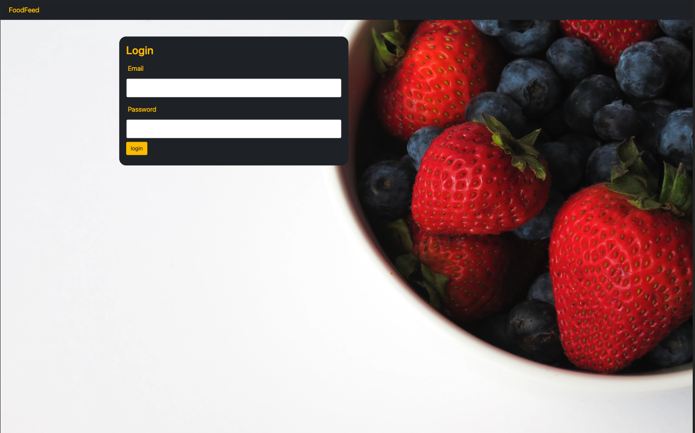
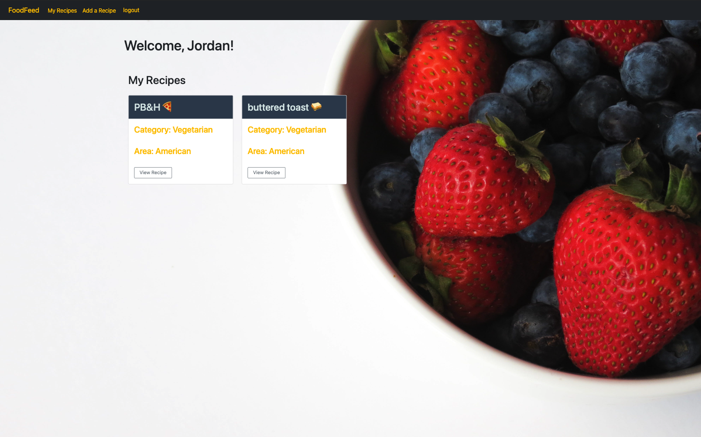
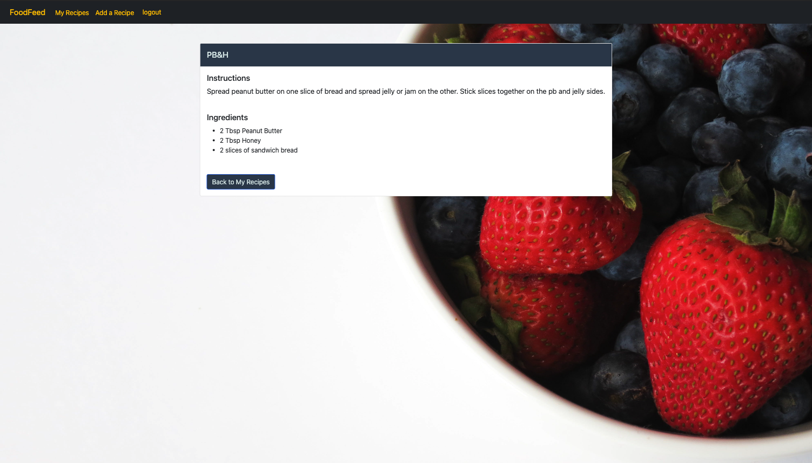
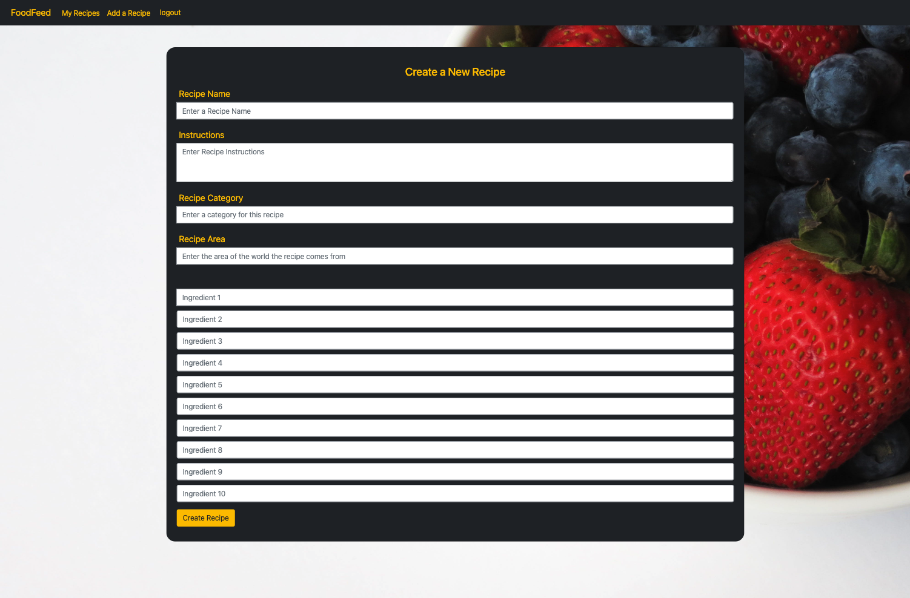

# FoodFeed

## Table of Contents

* [Technologies](#technologies)
* [Description](#description)
* [User story](#user-story)
* [Installation](#installation)
* [Usage](#usage)
* [Screenshots](#screenshots)
* [License](#license)

## Technologies

## Description
We are creating an app that will allow people to create and ssave recipes for food and drinks. It will include private logins and the ability to create a profile where the user can save and view their recipes.

## Installation

Link to deployed application: https://enigmatic-hollows-51581-85d21f4c37a7.herokuapp.com/login

Log in using the example account with email jordan99@msn.com and password password12345. Once logged in, the user can view the recipes associated with their account and add new recipes. 

## User Story
As a chef, I want to easily find and save recipes, so that I don't have to spend a lot of time looking for recipes.

## Usage
This app can be used as a virtual cookbook where users can save recipes and view them later on when they'd like to cook them. 

## Screenshots

Login Page: 
 

My Recipes (sample login): 

View Recipe:
 

Add Recipe:
 

## Technologies Used & Requirements Met

- Node.js and Express.js used for implementation of a RESTful API
- Handlebars.js for templating - see views folder
- MYSQL and Sequelize for database and ORM - see config, models, db folders
- GET and POST routes implemented in files in the controllers folder
- Includes authentication allowing users to login and saves sessions using Express Sessions and cookies
- .env file to protect API keys and sensitive information
- Repo is set up in MVC format
- We attempted to use Sass but ran out of time to properly implement it

## Credits

We used the code from module 14 activity 28 from our bootcamp class to start and customized it to fit our needs.

## License

  

[def]: #user_story